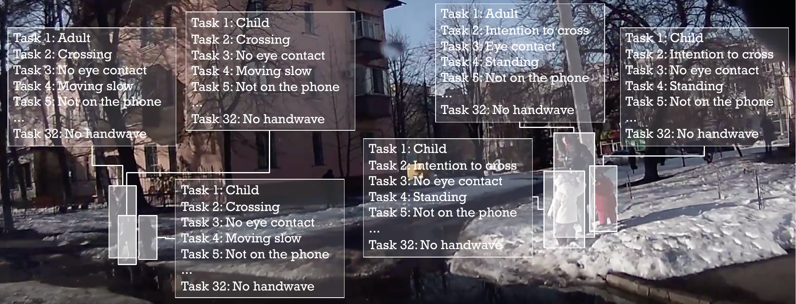

# Adapting Taylor Mordan plugin for JAAD to implement Haziq's method

Note that in the following I write Haziq Razali’s name either as “Haziq” or “Hazik” as I misread the name at the start of the project and used it incorrectly for almost the entirety of the project.

This repository aims to reproduce Haziq’s method from his paper which is no longer available by adapting the plugin created by Taylor Mordan in his paper “Detecting 32 Pedestrian Attributes for Autonomous Vehicles”.

Here we will describe the modifications that were brought to the plugin.

We have added the “Fix” folder which is a fix to openpifpaf as the location of the openpifpaf test was not able to be changed from the command line. 

## Modifications
We will now describe the modification brought to the plugin.

**openpifpaf_detection_attributes/datasets/jaad/attributes.py**: We added three attributes: “will_cross_reg”, “will_not_cross_reg” that belong to the “hazik” group and “is_not_crossing”

**openpifpaf_detection_attributes/datasets/jaad/datamodule.py**: We added command line arguments to be able to implement Haziq’s method. We can now use hazik augmentation instead of Taylor’s augmentation for training. We can also truncate, slice the dataset, and invert the “is_crossing” attribute. Note that “will_cross_reg” and “will_not_cross_reg” depend on “is_crossing” values.
Furthermore, we can choose which metrics we wish to use. For more details on how exactly to use the commands check the corresponding helps for --jaad-use-hazik-augmentation, --jaad-truncate, --jaad-slice, --jaad-metrics, --jaad-invert in the command line or directly in code in the cli() function.
We can also choose Haziq splits instead of the official JAAD split using 'hazik_train' or
'hazik_test'

**openpifpaf_detection_attributes/datasets/generators.py**: We have modified the generator to output the corresponding Gaussian when using “hazik” attributes and use the default behavior otherwise.

**openpifpaf_detection_attributes/datasets/metrics.py**: We have added 3 new metrics in addition to the InstanceDetection metric. The Classification metric mimics Haziq’s classification metric for attributes. InstanceHazikDetection is the same as InstanceDetection but adapted for Haziq attributes. ClassificationHazik is the reproduction of Haziq’s metrics. Each metric can be used when evaluating using the corresponding keyword in --jaad-metrics

**models/mtlfields/cifcaf_threadless.py**: This is the cifcaf decoder but where the openpifpaf.Decoder inheritance as been removed. It is used by the decoder to compute the openpifpaf bounding boxes.

**openpifpaf_detection_attributes/models/mtlfields/decoder.py**: We modified the decoder such that it could use the openpifpaf bounding box instead of the default detection attributes from Taylor Mordan’s method. We also weight the prediction with the Gaussian centered on each bounding box. This currently only works with 1 channel classification attributes or Haziq’s attributes.

**openpifpaf_detection_attributes/models/mtlfields/loss.py**:  We added support for loss where the arguments were None

## Results replication

The rest of the README after this section is the original README from Taylor Mordan. To be able to use the code provided in this repository one requires to do the same setup done in the “Installation” section below. Note that the requirements.txt file has changed to include pycocotools for openpifpaf evaluation.

The **scripts** folders contain all the different slurm bash scripts used in the project. The important scripts to reproduce the different results in the report are the following:

**scripts/hazik_replication**: Batch file to obtain the replicated Hazik method on the plugin and the corresponding evaluations. Uses Haziq’s split and evaluates Haziq metrics.

**scripts/fine_tuned**: Batch file to obtain the replicated Hazik method on the plugin where we have added Taylor’s data augmentation and auto-tune mtl. Uses official split and evaluates snip metrics.

**scripts/fine_tuned_hsplit**: Same as last batch file but uses Haziq’s split and evaluates Haziq metrics.

**scripts/fine_tune_30_wd**: Batch file to obtain the replicated Hazik method on the plugin where we have added Taylor’s data augmentation and auto-tune mtl. We also added weight decay and fine tuned the lambdas to get the best result we have achieved with Haziq’s method.

**scripts/fine_tune_30_wd_hsplit**:  Same as last batch file but uses Haziq’s split and evaluates Haziq metrics.

**scripts/taylor_replication**: Runs the same training as in Taylor’s paper on the official split and evaluates the snip metrics.

**scripts/taylor_pifpaf**: Runs the same training as in Taylor’s paper but only on the detection and will_cross heads with the added pifpaf heads on the official split and evaluates the snip metrics using either the detection head for Taylor’s model or the bounding boxes from pifpaf. The fork normalization is not used as it is not yet compatible with using openpifpaf heads and COCO dataset.


# Object Detection and Attribute Recognition with Fields

A [PyTorch](https://pytorch.org/) implementation of paper [Detecting 32 Pedestrian Attributes for Autonomous Vehicles](https://arxiv.org/abs/2012.02647) by Taylor Mordan (EPFL/VITA), Matthieu Cord (Sorbonne Université, valeo.ai), Patrick Pérez (valeo.ai) and Alexandre Alahi (EPFL/VITA).


#### Abstract

> Detecting 32 Pedestrian Attributes for Autonomous Vehicles
>
>Pedestrians are arguably one of the most safety-critical road users to consider for autonomous vehicles in urban areas.
>In this paper, we address the problem of jointly detecting pedestrians and recognizing 32 pedestrian attributes.
>These encompass visual appearance and behavior, and also include the forecasting of road crossing, which is a main safety concern.
>For this, we introduce a Multi-Task Learning (MTL) model relying on a composite field framework, which achieves both goals in an efficient way.
>Each field spatially locates pedestrian instances and aggregates attribute predictions over them.
>This formulation naturally leverages spatial context, making it well suited to low resolution scenarios such as autonomous driving.
>By increasing the number of attributes jointly learned, we highlight an issue related to the scales of gradients, which arises in MTL with numerous tasks.
>We solve it by normalizing the gradients coming from different objective functions when they join at the fork in the network architecture during the backward pass, referred to as fork-normalization.
>Experimental validation is performed on JAAD, a dataset providing numerous attributes for pedestrian analysis from autonomous vehicles, and shows competitive detection and attribute recognition results, as well as a more stable MTL training.



The model MTL-Fields learns multiple fields for both object detection and attribute recognition in a Multi-Task Learning way.
Learning is done on full images with dedicated field and image-wise loss function for each task, and predictions are obtained at inference through a post-processing instance-wise decoding step that yields a bounding box and all attributes for each detected instance.
This model is applied on dataset JAAD to detect up to 32 pedestrian attributes in an autonomous vehicle scenario.

The model MTL-Fields also contains a normalization of gradients during backward to solve gradient scale issues when learning numerous tasks.


### Table of Contents

- [Installation](#installation)
- [Dataset](#dataset)
- [Interfaces](#interfaces)
- [Training](#training)
- [Evaluation](#evaluation)
- [Project structure](#project-structure)
- [License](#license)
- [Citation](#citation)
- [Acknowledgements](#acknowledgements)


## Installation

Clone this repository in order to use it.
```
# To clone the repository using HTTPS
git clone https://github.com/vita-epfl/detection-attributes-fields
cd detection-attributes-fields/
```

All dependencies can be found in the `requirements.txt` file.
```
# To install dependencies
pip3 install -r requirements.txt
```

This project has been tested with Python 3.7.7, PyTorch 1.8.1 and CUDA 10.2.


## Dataset

This project uses dataset [JAAD](http://data.nvision2.eecs.yorku.ca/JAAD_dataset/) for training and evaluation.

Please refer to JAAD documentation to download the dataset.


## Interfaces

This project is implemented as an [OpenPifPaf](https://github.com/openpifpaf/openpifpaf) plugin module.
As such, it benefits from all the core capabilities offered by OpenPifPaf, and only implements the additional functions it needs.

All the commands can be run through OpenPifPaf's interface using subparsers.
Help can be obtained for any of them with option `--help`.
More information can be found in [OpenPifPaf documentation](https://openpifpaf.github.io/intro.html).


## Training

Training is done using subparser `openpifpaf.train`.

Training on JAAD with all attributes can be run with the command:
```
python3 -m openpifpaf.train \
  --output <path/to/model.pt> \
  --dataset jaad \
  --jaad-root-dir <path/to/jaad/folder/> \
  --jaad-subset default \
  --jaad-training-set train \
  --jaad-validation-set val \
  --log-interval 10 \
  --val-interval 1 \
  --epochs 5 \
  --batch-size 4 \
  --lr 0.0005 \
  --lr-warm-up-start-epoch -1 \
  --weight-decay 5e-4 \
  --momentum 0.95 \
  --basenet fn-resnet50 \
  --pifpaf-pretraining \
  --detection-bias-prior 0.01 \
  --jaad-head-upsample 2 \
  --jaad-pedestrian-attributes all \
  --fork-normalization-operation power \
  --fork-normalization-duplicates 35 \
  --lambdas 7.0 7.0 7.0 7.0 1.0 1.0 1.0 1.0 1.0 1.0 1.0 1.0 1.0 1.0 1.0 1.0 1.0 1.0 1.0 1.0 1.0 1.0 1.0 1.0 1.0 1.0 1.0 1.0 1.0 1.0 1.0 1.0 1.0 1.0 1.0 \
  --attribute-regression-loss l1 \
  --attribute-focal-gamma 2 \
  --auto-tune-mtl
```
Arguments should be modified appropriately if needed.

More information about the options can be obtained with the command:
```
python3 -m openpifpaf.train --help
```


## Evaluation

Evaluation of a checkpoint is done using subparser `openpifpaf.eval`.

Evaluation on JAAD with all attributes can be run with the command:
```
python3 -m openpifpaf.eval \
  --output <path/to/outputs> \
  --dataset jaad \
  --jaad-root-dir <path/to/jaad/folder/> \
  --jaad-subset default \
  --jaad-testing-set test \
  --checkpoint <path/to/checkpoint.pt> \
  --batch-size 4 \
  --jaad-head-upsample 2 \
  --jaad-pedestrian-attributes all \
  --head-consolidation filter_and_extend \
  --decoder-s-threshold 0.2 \
  --decoder-optics-min-cluster-size 10 \
  --decoder-optics-epsilon 5.0 \
  --decoder-optics-cluster-threshold 0.5
```
Arguments should be modified appropriately if needed.

Using option `--write-predictions`, a json file with predictions can be written as an additional output.

Using option `--show-final-image`, images with predictions displayed on them can be written in the folder given by option `--save-all <path/to/image/folder/>`.
To also display ground truth annotations, add option `--show-final-ground-truth`.

More information about the options can be obtained with the command:
```
python3 -m openpifpaf.eval --help
```


## Project structure

The code is organized as follows:
```
openpifpaf_detection_attributes/
├── datasets/
│   ├── jaad/
│   ├── (+ common files for datasets)
│   └── (add new datasets here)
└── models/
    ├── mtlfields/
    ├── (+ common files for models)
    └── (add new models here)
```


## License

This project is built upon [OpenPifPaf](https://openpifpaf.github.io/intro.html) and shares the AGPL Licence.

This software is also available for commercial licensing via the EPFL Technology Transfer
Office (https://tto.epfl.ch/, info.tto@epfl.ch).


## Citation

If you use this project in your research, please cite the corresponding paper:
```text
@article{mordan2020detecting,
  title={Detecting 32 Pedestrian Attributes for Autonomous Vehicles},
  author={Mordan, Taylor and Cord, Matthieu and P{\'e}rez, Patrick and Alahi, Alexandre},
  journal={arXiv preprint arXiv:2012.02647},
  year={2020}
}
```


## Acknowledgements

We would like to thank Valeo for funding our work, and Sven Kreiss for the OpenPifPaf Plugin architecture.
